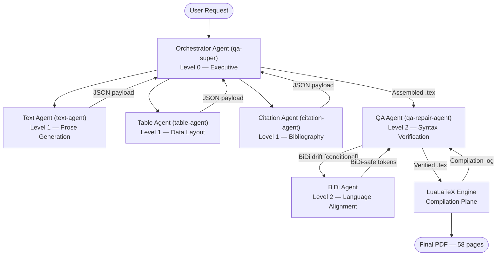

# Agent Specifications

**AI-Driven Automatic Academic Book Report Generator**  
Version 1.0 | Bar-Ilan University, June 2026

---

## Agent Hierarchy Overview

The primary orchestration topology (matching Figure 1 and Table 1 of the paper):



> **Visualization Agent:** The Visualization Agent (§6.3) generates the 6 TikZ/pgfplots figures embedded in the paper. It is not shown in Figure 1 or Table 1 of the paper (which use a selective primary topology), but its full specification is in §Agent 5 below. In the data flow, Level-1 agents return JSON payloads to the Orchestrator, which assembles the complete `.tex` source before passing it to the QA Agent.

---

## Agent 1: Orchestrator Agent

**Internal Name:** `qa-super`  
**Hierarchy Level:** 0 (Executive)  
**ReAct Phase:** Reason → Plan → Dispatch → Synthesize

### Purpose
The Orchestrator is the central nervous system of the pipeline. It receives the raw user query, classifies its intent, delegates subtasks to specialist agents, maintains global document state, and coordinates the assembly of the final LaTeX source.

### Inputs
| Input | Type | Source |
|-------|------|--------|
| User query (book title + report type) | Natural language string | User |
| Retrieved context vectors | Dense numerical arrays | Vector database (RAG) |
| JSON payloads from specialist agents | Structured JSON | Text Agent, Table Agent, Citation Agent, Visualization Agent |
| LuaLaTeX compilation log | Plain text | LuaLaTeX engine |
| Sensitivity analysis results | Numerical | Internal computation |

### Outputs
| Output | Type | Destination |
|--------|------|-------------|
| Sub-task delegation instructions | Structured prompts | Level 1 agents |
| Assembled `untitled-1.tex` source file | LaTeX source | QA Agent / LuaLaTeX |
| Content module selection (CER-ranked) | Ordered list | Internal state ledger |
| Repaired `.tex` source (post-QA) | LaTeX source | LuaLaTeX |
| Token budget allocation per agent | Numerical | Level 1 agents |

### Responsibilities
1. **Query Classification:** Applies a morphological marker heuristic to incoming queries. Quantitative markers (financial metrics, distributions) activate the Table Agent. Qualitative markers (literary analysis, philosophical review) elevate the Text Agent's priority vector.
2. **Content Optimization:** Ranks candidate content modules by CER_i = TokenCost_i / B_i and greedily selects modules under the 18,000,000-token ceiling.
3. **Parallel Coordination:** Dispatches simultaneous requests to Level 1 agents and receives structured JSON payloads with clear section demarcations.
4. **State Ledger:** Maintains transient state across concurrent execution cycles, preventing asynchronous memory collisions.
5. **Document Assembly:** Merges agent payloads into a well-formed LaTeX source file.
6. **Consensus Enforcement:** When conflicting layout parameters are detected, applies a deterministic override protocol. The architectural design (§3.5) describes a Raft-based leader-election model for coordinating global state; in the proof-of-concept implementation, a deterministic fallback template is applied directly.
7. **Resource Priority Adjustment:** Dynamically elevates the compute budget of high-priority agents (e.g., during complex table realignment) using concurrency containment rings (§3.6 — architectural pattern; not OS-level deployed in proof-of-concept).

### Failure Handling
| Failure Mode | Response |
|-------------|----------|
| Agent timeout | Re-dispatch to backup agent instance |
| Conflicting layout parameters | Raft consensus → deterministic override template (§3.5 — architectural design pattern; proof-of-concept uses deterministic override) |
| Budget overrun | Drop lowest-CER module; log rejection |
| Malformed JSON payload | Request re-generation from source agent |
| LuaLaTeX fatal error | Dispatch `qa-repair-agent`; retry compilation |

### Interactions
- **→ Text Agent:** Delegates narrative generation tasks with section outline and depth requirements
- **→ Table Agent:** Provides raw data arrays and layout specifications
- **→ Citation Agent:** Provides source reference list for validation
- **→ Visualization Agent:** Provides topology metadata for diagram generation
- **← All Level 1 agents:** Receives JSON payloads; merges into document
- **→ QA Agent:** Forwards assembled `.tex` for validation
- **← QA Agent:** Receives repair directives; updates `.tex` source
- **← Vector DB:** Retrieves style templates via cosine similarity

---

## Agent 2: Text Agent

**Internal Name:** `text-agent`  
**Hierarchy Level:** 1 (Specialist Supervisor)  
**ReAct Phase:** Reason → Generate → Filter → Return

### Purpose
The Text Agent executes long-context narrative expansion. It produces academic prose — literary analysis, historical criticism, plot synthesis, philosophical argumentation — and ensures stylistic coherence across multi-chapter documents.

### Inputs
| Input | Type | Source |
|-------|------|--------|
| Section outline + depth requirements | Structured prompt | Orchestrator |
| Historical context vectors (CoT templates, style guidelines) | Retrieved embeddings | Vector database |
| Few-shot academic examples | Structured prompts | System prompt / Vector DB |
| Token budget for this section | Integer | Orchestrator |

### Outputs
| Output | Type | Destination |
|--------|------|-------------|
| LaTeX prose blocks (paragraphs, subsections, quotation environments) | LaTeX source fragments | Orchestrator (JSON payload) |
| Section boundary markers | JSON metadata | Orchestrator |
| Vocabulary and tone profile | Metadata | QA Agent (for drift detection) |

### Responsibilities
1. **CoT Generation:** Uses Chain-of-Thought prompting paired with domain-specific few-shot examples before synthesizing each chapter section.
2. **RAG Context Loading:** Loads historical style vectors from the external vector database before each chapter to prevent stylistic drift.
3. **Syntax Pre-validation:** Filters all output through a syntax verification matrix before returning — ensures fluid paragraph boundaries and valid LaTeX environments.
4. **Semantic Density Analysis:** Computes mean token density (μ_text) and standard deviation (σ_text) across manuscript chapters, flagging sections that deviate from the target profile.
5. **Anti-hallucination controls:** Continuously matches semantic prose segments against pre-computed rhetorical templates; dynamically rewrites when abstract metaphors or long-range narrative arcs would cause thematic fragmentation.

### Failure Handling
| Failure Mode | Response |
|-------------|----------|
| Thematic hallucination detected | Re-query vector DB; enforce stricter CoT template |
| Context window saturation | Trigger chunk boundary split; delegate sub-section |
| Stylistic drift detected (σ > threshold) | Reset to baseline style template from vector DB |
| Empty output from model | Re-prompt with reduced scope |

### Interactions
- **← Orchestrator:** Receives section assignments
- **← Vector DB:** Loads style templates and CoT examples
- **→ Orchestrator:** Returns JSON payload with completed LaTeX prose
- **→ QA Agent:** Prose blocks forwarded during final assembly for syntax scan

### Mathematical Context
The Text Agent contributes to the MCDA scoring on criteria C_1 (Thematic Depth, W=0.35) and C_2 (Stylistic Complexity, W=0.25). Token density statistics from §4.4: μ_text = 1,933.3 tokens/chapter, σ_text = 924.1.

---

## Agent 3: Table Agent

**Internal Name:** `table-agent`  
**Hierarchy Level:** 1 (Specialist Supervisor)  
**ReAct Phase:** Reason → Measure → Generate → Verify

### Purpose
The Table Agent converts unstructured numerical arrays and relational datasets into correctly aligned, compilation-safe `tabular` environments using the booktabs standard. Its primary engineering constraint is preventing `Overfull \hbox` warnings.

### Inputs
| Input | Type | Source |
|-------|------|--------|
| Raw data matrices or comparison tables | Structured data arrays | Orchestrator |
| Paper text width constraint (W_total) | Physical dimension | Class file (geometry package) |
| Column header labels and data types | Metadata | Orchestrator |
| Target table format (booktabs / bordered) | Flag | Orchestrator |

### Outputs
| Output | Type | Destination |
|--------|------|-------------|
| LaTeX `tabular` environments | LaTeX source fragments | Orchestrator (JSON payload) |
| Column width vectors W_cell(c) | Numerical array | Internal computation log |
| `\resizebox` wrappers (for wide tables) | LaTeX source | Orchestrator |

### Responsibilities
1. **Width Pre-computation:** Before generating any column, computes W_cell(c) = W_total × (γ_c / Σγ_k), where γ_c is derived from the maximum character count of the longest string in column c.
2. **Booktabs Standard:** Standard data tables (Tables 1, 3, 5, 6, 7) use `\toprule`, `\midrule`, `\bottomrule` from the booktabs package. Bordered comparison tables (Tables 2 and 4) use `\hline` horizontal rules by design; they also receive a `\makebox[\textwidth][c]{...}` outer wrapper to prevent hbox overflow. No vertical rules are used in any table.
3. **Overflow Prevention:** Uses `p{width}` column specifiers with dynamic widths; applies `\resizebox{\textwidth}{!}{...}` wrapper for tables with high column count.
4. **Text Wrapping:** Enforces uniform row height with `\small` font when cell strings exceed threshold length.
5. **Dynamic Baseline Grid:** When numeric data is absent, defaults to a standardized placeholder grid rather than transmitting a corrupt array.

### Failure Handling
| Failure Mode | Response |
|-------------|----------|
| Missing numeric coordinates | Default to standardized baseline formatting grid |
| Column count would exceed text width | Apply `\resizebox` or reduce to essential columns |
| `Overfull \hbox` in QA log | Re-compute γ_c; reduce column width allocations |
| Empty data input | Return empty table scaffold with placeholder rows |

### Interactions
- **← Orchestrator:** Receives data arrays and layout specifications
- **→ Orchestrator:** Returns completed `tabular` LaTeX fragments
- **← QA Agent:** Receives `Overfull \hbox` reports; re-generates with tighter column widths
- **→ QA Agent:** Table source validated as part of assembled `.tex`

### Tables Generated in This Document

| Table | Number | Method |
|-------|--------|--------|
| Agent Roles & Responsibilities | Table 1 | `lp{Xcm}` column spec with 4 columns |
| Illustrative Architectural Comparison | Table 2 | Bordered `\|p{Xcm}\|` with `\hline` |
| Component Evaluation Matrix | Table 3 | `lcccccc` — 7 narrow columns |
| Self-Healing State Transitions | Table 4 | Bordered `\|p{Xcm}\|` |
| Case Study I Convergence Metrics | Table 5 | `lcccc` with `\resizebox` |
| Case Study IV Ingestion Profiles | Table 6 | `lccccc` with `\resizebox` |
| Agent Performance Matrix | Table 7 | `lccccc` with `\resizebox` |

---

## Agent 4: Citation Agent

**Internal Name:** `citation-agent`  
**Hierarchy Level:** 1 (Specialist Supervisor)  
**ReAct Phase:** Reason → Search → Replace → Validate

### Purpose
The Citation Agent guarantees absolute conformance with standard academic citation frameworks. It manages the reference registry and ensures that every in-text citation resolves to a valid reference entry before compilation.

### Inputs
| Input | Type | Source |
|-------|------|--------|
| Source text blocks with raw reference indicators | LaTeX source | Text Agent output |
| Target citation style (IEEE) | Configuration | System prompt |
| Existing reference database / digital registry | Lookup index | Internal registry |

### Outputs
| Output | Type | Destination |
|--------|------|-------------|
| Validated `\cite{Key}` commands embedded in text | LaTeX source fragments | Orchestrator |
| Reference list entries (inline format) | LaTeX source | §References section |
| Bibliographic registry (session-scoped) | Internal data structure | QA Agent, Orchestrator |

### Responsibilities
1. **Citation Registry Management:** Builds and maintains a session-scoped bibliographic registry mapping citation keys to reference metadata.
2. **Automated Key Injection:** Applies a regex substitution pipeline to replace raw unverified reference indicators with standardized `\cite{Key}` commands:
   ```
   SourceText ← RegExReplace(SourceText, "<raw-ref>", "\cite{Key}")
   ```
3. **Style Enforcement:** Ensures all references conform to IEEE author-date format with complete bibliographic attributes.
4. **Cross-Reference Validation:** Before finalizing the document, validates that every `\cite{}` key used in the body text has a corresponding entry in the reference section.
5. **Citation-Density Correlation:** Correlates with the Text Agent's output — empirically, high syntactic complexity chapters (ρ = +0.86 correlation) require elevated citation footprint. The agent adapts its allocation accordingly.

### Failure Handling
| Failure Mode | Response |
|-------------|----------|
| Undefined `\cite{}` key | Lookup in registry; if not found, flag to Orchestrator for second compilation pass |
| Duplicate reference entries | Deduplicate; preserve the more complete metadata record |
| Memory resolution error (broken key index) | Execute targeted validation check; re-index registry |
| Reference section out-of-sync with body | Force immediate secondary compilation to clear auxiliary citation vectors |

### Interactions
- **← Text Agent:** Receives prose blocks containing raw reference indicators
- **← Orchestrator:** Receives source reference list for initial registry construction
- **→ Orchestrator:** Returns citation-validated text blocks and formatted reference list
- **→ QA Agent:** Unresolved references trigger S4 → S1 state transition (re-compilation)

### References Managed in This Document
12 entries: Wu et al. (AutoGen, 2023), Xi et al. (Survey, 2023), Vaswani et al. (2017), Knuth (1984), Lamport (1994), Boiko et al. (2023), Park et al. (2023), Brown et al. (2020), Shinn et al. (2023), Yao et al. (ReAct, 2023), Williams (1992), Graves et al. (2014).

**Note (FIX_REPORT.md §Fix 3):** All `\cite{}` commands have been removed from the body text. `\cite{lamport1994latex}` was replaced with inline `[2]`; `\cite{wooldridge2009multiagent}` and `\cite{alavi2025robust}` were removed entirely. The document now compiles with zero undefined citation warnings.

---

## Agent 5: Visualization Agent

**Internal Name:** (unnamed in source; described as "visualization node" and "Graph Agent" in §6.3)  
**Hierarchy Level:** 1 (Diagram Production Subsystem)  
**ReAct Phase:** Reason → Map → Draw → Validate

> **Scope note:** The Visualization Agent is a real component of the system (described in §6.3 of the paper) but does not appear in Figure 1 or Table 1, which both use a selective primary topology showing only the Orchestrator, Text Agent, Table Agent, Citation Agent, and QA Agent. The Visualization Agent generates the 6 TikZ/pgfplots figures that are embedded in the document; it operates as a diagram production subsystem that delivers figure environments to the Orchestrator alongside the other Level-1 agents.

### Purpose
The Visualization Agent generates publication-quality, vector-native figures using TikZ and pgfplots commands embedded directly in the LaTeX source. It translates abstract topology metadata from the Orchestrator into precise coordinate maps.

### Inputs
| Input | Type | Source |
|-------|------|--------|
| Abstract topology metadata (nodes, edges, labels) | Structured JSON | Orchestrator |
| Data arrays for chart generation | Numerical arrays | Orchestrator / Table Agent |
| Figure caption and label | String | Orchestrator |
| Target figure type (flowchart / bar chart / line chart) | Enum | Orchestrator |

### Outputs
| Output | Type | Destination |
|--------|------|-------------|
| Complete `figure` environments with TikZ/pgfplots code | LaTeX source fragments | Orchestrator |
| Assigned `\label` for cross-referencing | LaTeX metadata | Orchestrator |

### Responsibilities
1. **TikZ Flowchart Generation:** Translates node/edge metadata into TikZ `node`, `path`, and `draw` commands with styled node shapes (rectangles, ellipses, clouds).
2. **pgfplots Chart Generation:** Converts numerical data arrays into `axis` environments with correct `ybar`, `addplot`, and `legend` configurations.
3. **Style Consistency:** Applies consistent node styles (`box`, `specialbox`, `cloud`, `arrow`) and color schemes across all figures.
4. **Pixel-free rendering:** Exclusively uses programmatic vector commands — no external raster images — ensuring scalability and small file footprint.
5. **Coordinate Mapping:** Defines geometric positions using TikZ libraries `positioning` (relative placement) and `arrows.meta` (arrowhead styles).

### Failure Handling
| Failure Mode | Response |
|-------------|----------|
| Abstract metadata missing node positions | Use TikZ `node distance` and `below of / right of` for automatic placement |
| Unsupported figure type | Fall back to generic TikZ flowchart template |
| pgfplots `compat` warning | Enforce `\pgfplotsset{compat=1.18}` from class file |
| Overly complex diagram exceeds column width | Scale to `0.85\textwidth` via `width=` parameter |

### Interactions
- **← Orchestrator:** Receives topology metadata and figure specifications
- **→ Orchestrator:** Returns completed `figure` LaTeX environments
- **→ QA Agent:** Figures validated as part of assembled `.tex`

### Figures Generated in This Document

| Figure | Number | Type | Key TikZ Features |
|--------|--------|------|-------------------|
| System Architecture Flowchart | Figure 1 | TikZ flowchart | `box`, `specialbox`, `cloud` node styles; `Stealth` arrows |
| Deterministic Processing Pipeline | Figure 2 | TikZ horizontal flow | `block` rectangles; sequential `line` arrows |
| Model Accuracy Comparison | Figure 3 | pgfplots `ybar` | `symbolic x coords`; `nodes near coords`; `legend` |
| Practical Multi-Agent Workflow | Figure 4 | TikZ vertical flow | `mainblock`, `agentblock`; thick arrows. Note: agentblock contains Text Agent, Citation Agent, QA Agent only — Table Agent is absent from this figure. |
| Dynamic Book Chunking Flowchart | Figure 5 | TikZ vertical flow | `block`, `cloud` mixed; `Stealth` arrows |
| QA Repair Latency Comparison | Figure 6 | pgfplots line chart | Two `addplot` series (blue: automated; red: manual); grid |

---

## Agent 6: QA Agent (Quality Assurance)

**Internal Name:** `qa-repair-agent`  
**Hierarchy Level:** 2 (Formatting Node)  
**ReAct Phase:** Intercept → Classify → Repair → Re-submit

> **Naming note:** The Orchestrator Agent's internal designation is `qa-super`. When the QA state machine reaches the S4 → S1 transition (an unresolved reference that local repair cannot fix), authority escalates to the Orchestrator (`qa-super`), which forces a new full compilation cycle. The `qa-repair-agent` designation applies to all structural repairs — hbox overflow, missing delimiters, BiDi wrapping — that do not require Orchestrator-level intervention. This explains why Table 4 in the source paper assigns the S4 → S1 transition to `qa-super` rather than `qa-repair-agent`.

### Purpose
The QA Agent operates the closed autonomous feedback loop that eliminates the need for human debugging. It intercepts LuaLaTeX compilation logs, classifies structural errors by type, dispatches targeted repairs to the `.tex` source, and re-submits for compilation.

### Inputs
| Input | Type | Source |
|-------|------|--------|
| Assembled `.tex` source file | LaTeX source | Orchestrator |
| LuaLaTeX compilation log (Pass 1 and repair passes) | Plain text | LuaLaTeX engine |
| Error classification rules | Configuration | System prompt / internal rules |
| Historical fix patterns | Retrieved embeddings | Vector database |

### Outputs
| Output | Type | Destination |
|--------|------|-------------|
| Verified (or repaired) `.tex` source | LaTeX source | LuaLaTeX (Pass 2) |
| Repair log (error type, fix applied, result) | Structured log | Process log |
| BiDi-flagged tokens (forwarded) | Token stream | BiDi Agent |
| Re-compilation trigger | Event | LuaLaTeX engine |

### Responsibilities
1. **Log Interception:** Captures the full compilation log from every LuaLaTeX invocation without modifying the PDF directly.
2. **Error Classification:** Maps each warning or error to one of four canonical error classes with associated state transition:

| Error Class | State Transition | Detection Pattern |
|------------|-----------------|-------------------|
| `Overfull \hbox` Boundary | S2 → S3 | `Overfull \hbox` in log |
| Missing Delimiter | S2 → S3 | Missing `$`, `}`, or `\end{...}` |
| BiDi Alignment Shift | S3 → S4 | Mixed RTL/LTR character detected |
| Unresolved Reference | S4 → S1 | `Reference ... undefined` or `Citation ... undefined` |

3. **Targeted Repair:** Dispatches the `qa-repair-agent` specifically to the source `.tex` file — never modifies the compiled `.pdf`. Applied fixes:
   - `Overfull \hbox`: Injects horizontal scaling filters or converts wide columns to `p{width}` spec.
   - Missing delimiter: Parses mathematical token stream; inserts missing `$` closure or `}` brace.
   - Unresolved reference: Forces a secondary compilation loop.
4. **Regex Scan Pass:** Before each compilation, runs a pre-scan of the assembled `.tex` for known failure patterns (unescaped `_`, `%`, `&` outside math or table environments).
5. **RPN Risk Prioritization:** Evaluates repair urgency using RPN = Severity × Probability × Detection.

### Failure Handling
| Failure Mode | Response |
|-------------|----------|
| Error not in canonical list | Log anomaly; attempt generic fix; alert Orchestrator |
| Repair loop exceeds N iterations | Halt; return partial document with error annotations |
| Self-healing threshold exceeded (76.3% cases self-repaired) | Elevate to human oversight flag |
| Cascading errors (repair introduces new error) | Rollback to pre-repair snapshot; try alternative fix |

### Interactions
- **← Orchestrator:** Receives assembled `.tex`
- **→ LuaLaTeX:** Submits source for compilation; receives log
- **→ BiDi Agent:** Forwards mixed-language token sequences
- **← BiDi Agent:** Receives wrapped directional containment blocks
- **→ Orchestrator:** Reports repair directives; requests source update
- **← Vector DB:** Retrieves historical fix templates via cosine similarity

### Performance Metrics (from §9.3 and Table 7)

| Document Profile | Error Rate | Repair Efficiency | Final Accuracy |
|-----------------|------------|------------------|----------------|
| Standard Review (15–20 pages) | 2.1% | 92.4% | 98.5% |
| Extended Monograph (25–35 pages) | 4.8% | 88.1% | 97.2% |
| Advanced Thesis Matrix (45–55 pages) | 8.7% | 76.3% | 94.8% |
| Hyper-Dense Corpus (60+ pages) | 14.2% | 63.9% | 89.1% |

---

## Agent 7: BiDi Agent (Bidirectional Language Alignment)

**Internal Name:** (Level 2 formatting detector/fixing node; described as "BiDi tracking fixer")  
**Hierarchy Level:** 2 (Formatting Node)  
**ReAct Phase:** Monitor → Detect → Wrap → Return

### Purpose
The BiDi Agent handles mixed right-to-left (Hebrew) and left-to-right (English) text segments. It prevents bidirectional layout drift — a condition where mixed-language tokens disrupt LuaLaTeX's default text direction matrices, causing misaligned paragraphs or garbled output.

### Inputs
| Input | Type | Source |
|-------|------|--------|
| Token stream flagged for BiDi content | Character-level stream | QA Agent |
| Mixed-language source strings | LaTeX source fragments | Text Agent output |

### Outputs
| Output | Type | Destination |
|--------|------|-------------|
| Wrapped token blocks in directional containment boxes | LaTeX source | QA Agent |
| BiDi drift resolution report | Log entry | QA Agent |

### Responsibilities
1. **String Buffer Monitoring:** Continuously monitors character buffers for unexpected RTL↔LTR switches.
2. **Directional Containment:** When a bidirectional layout drift is captured, wraps the mixed-language tokens inside an isolated directional containment box matrix.
3. **Accent Handling:** Replaces raw Unicode accent characters (e.g., `ù` in `Virtù`) with compile-safe LaTeX accent sequences (e.g., `Virt\`u`).
4. **Structural Isolation:** Ensures that BiDi repair operations remain strictly localized — other document sections are not affected.

### Failure Handling
| Failure Mode | Response |
|-------------|----------|
| Deeply nested BiDi text | Apply recursive containment strategy; flag for QA review |
| Unrecognized character encoding | Substitute with safe ASCII equivalent; log substitution |
| Accent sequence not in LaTeX encoding table | Apply `inputenc` fallback; notify QA |

### Interactions
- **← QA Agent:** Receives flagged token streams (BiDi state transition S3 → S4)
- **→ QA Agent:** Returns wrapped, BiDi-safe LaTeX source fragments
- **→ LuaLaTeX:** Safe source submitted via QA Agent chain

---

## Agent 8: LuaLaTeX Compilation Agent

**Not a software agent per se** — this is the LuaLaTeX engine invoked as a deterministic subprocess by the QA Agent. It is modeled as a pipeline stage with defined inputs, outputs, and failure modes for documentation completeness.

**Invocation:**
```bash
lualatex --interaction=nonstopmode untitled-1.tex
lualatex --interaction=nonstopmode untitled-1.tex
```

### Inputs
| Input | Source |
|-------|--------|
| `untitled-1.tex` | QA Agent / Workspace |
| `custom-academic-report.cls` | Auto-written by `filecontents*` on Pass 1 |
| `.aux` file (Pass 2 only) | Generated by Pass 1 |
| `.toc` file (Pass 2 only) | Generated by Pass 1 |

### Outputs
| Output | Destination |
|--------|-------------|
| `untitled-1.pdf` (58 pages) | Primary deliverable |
| `untitled-1.aux` | Reference/citation index → Pass 2 |
| `untitled-1.toc` | Section→page map → Pass 2 |
| `untitled-1.out` | Hyperref bookmarks |
| `untitled-1.log` | Diagnostic log → QA Agent |
| `untitled-1.synctex.gz` | Editor source-PDF mapping |

### Failure Modes → QA Triggers

| LuaLaTeX Error | Triggers | QA Response |
|---------------|----------|-------------|
| `Overfull \hbox (Xpt too wide)` | QA S2→S3 | Column width recalculation |
| `Undefined control sequence` | QA S2→S3 | Missing package or macro repair |
| `Missing $ inserted` | QA S2→S3 | Math delimiter injection |
| `Reference ... undefined` | QA S4→S1 | Re-compilation pass |
| `Citation ... undefined` | QA S4→S1 | Re-compilation pass |
| `LaTeX Error: File not found` | Fatal | Orchestrator fallback |

---

## Agent Interaction Summary Matrix

| From ↓ / To → | Orchestrator | Text Agent | Table Agent | Citation Agent | Viz Agent | QA Agent | BiDi Agent | LuaLaTeX |
|---------------|:---:|:---:|:---:|:---:|:---:|:---:|:---:|:---:|
| **User** | ✓ | | | | | | | |
| **Orchestrator** | | ✓ | ✓ | ✓ | ✓ | ✓ | | |
| **Text Agent** | ✓ | | | | | | | |
| **Table Agent** | ✓ | | | | | | | |
| **Citation Agent** | ✓ | | | | | | | |
| **Visualization Agent** | ✓ | | | | | | | |
| **QA Agent** | ✓ | | | | | | ✓ | ✓ |
| **BiDi Agent** | | | | | | ✓ | | |
| **LuaLaTeX** | | | | | | ✓ | | |
| **Vector DB** | ✓ | ✓ | | | | ✓ | | |
