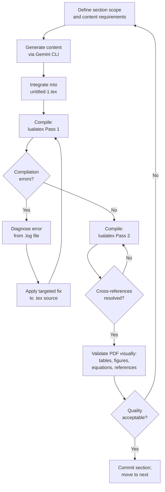

# Development Process

**AI-Driven Automatic Academic Book Report Generator**  
Version 1.0 | Bar-Ilan University, June 2026

---

## 1. Overview

The development of this project followed an **iterative, tool-driven workflow** combining an LLM-based AI assistant (Gemini CLI) with repeated LuaLaTeX compilation cycles and manual validation. This process closely mirrors the multi-agent architecture described in the paper itself: distinct functional responsibilities — text generation, table construction, citation management, diagram generation, and quality assurance — were coordinated through a central interface (Gemini CLI acting as the practical Orchestrator), with iterative feedback loops replacing the automated self-healing described theoretically.

The paper states explicitly (§7.1, §9):
> "The project was developed through an iterative practical workflow that combined Gemini CLI, LuaLaTeX compilation, and manual validation of the generated academic document."

---

## 2. Development Environment

| Tool | Role | Configuration |
|------|------|---------------|
| **Gemini CLI** | Primary AI working environment; content generation, structure refinement, correction cycles | Cloud-based, interactive |
| **LuaLaTeX** | Document compiler — converts `.tex` source to PDF | `--interaction=nonstopmode` |
| **TeX Live / MiKTeX** | LaTeX distribution providing all required packages | Full installation |
| **Python 3** | Workspace management utilities (LocalWorkspaceManager) | Standard library only (`os`, `shutil`) |
| **WEKA** | Data mining evaluation subsystem (Appendix A.7 only; not used as an active development tool in the generation pipeline) | J48, Random Forest, Naive Bayes |
| **Text editor / IDE** | Source editing between compilation passes | Not specified |

---

## 3. Development Methodology

### 3.1 Iterative Refinement Loop

The development process followed this repeating cycle:

### 3.2 Functional Separation

The development workflow preserved separation of concerns by treating each functional area as a distinct task, delegated separately to Gemini CLI:

| Functional Area | Development Activity |
|----------------|---------------------|
| Document structure | Defining section hierarchy, creating outline |
| Prose generation | Generating academic text for each section |
| Mathematical modeling | Deriving and typesetting all formal equations |
| Table construction | Designing column layouts, computing widths, formatting booktabs tables |
| TikZ diagram generation | Writing coordinate-based flowchart and chart code |
| Citation management | Validating reference list, embedding `\cite{}` commands |
| Class file design | Defining `custom-academic-report.cls` features and embedding via `filecontents*` |
| Appendix content | Generating extended technical discussion and code samples |

---

## 4. Technical Challenges Encountered

The paper (§7.1) explicitly documents the technical challenges encountered during development:

### 4.1 LuaLaTeX Compilation Errors

**Challenge:** LuaLaTeX compilation errors caused by package conflicts, missing class definitions, and incorrect mathematical syntax.

**Examples encountered:**
- `custom-academic-report.cls` initially needed to be present on disk before the `\documentclass` directive was processed. This was resolved by embedding the class definition in a `filecontents*` block at the very top of the `.tex` file, which writes the `.cls` to disk automatically on the first pass.
- Mathematical expressions containing bare `\` sequences, unmatched `{`, or un-delimited math modes caused `Undefined control sequence` or `Missing $ inserted` errors.
- The `pgfplots` package required explicit `\pgfplotsset{compat=1.18}` to avoid backwards-compatibility warnings.

**Resolution:** Repeated compilation-diagnosis-fix cycles. The compilation log (`.log` file) was the primary diagnostic tool. Each error was traced to its source line and corrected before the next pass.

### 4.2 Cross-Reference Consistency

**Challenge:** Maintaining consistency between the generated text, the table of contents, figure labels, table labels, and the reference list across a 1,064-line source file.

**Examples encountered:**
- Forward references to `\ref{fig:system_architecture}` (Figure 1) and `\ref{tab:case_study_one}` (Table 5) required two compilation passes to resolve correctly.
- `\label` commands had to appear in the correct position relative to their `\caption` commands within float environments (`figure`, `table`).
- The `\nocite{*}` command interacted with the `cite` package in the absence of a `.bib` file; the inline reference list required manual formatting.

**Resolution:** Systematic labeling convention (`fig:`, `tab:` prefixes); two-pass compilation as standard procedure.

### 4.3 Table Layout and Overflow

**Challenge:** Tables with multiple wide columns, especially those with text-heavy cells, caused `Overfull \hbox` warnings that pushed content beyond the page margin.

**Resolution:**
- Narrow data tables: `lcccc` column specification with fixed-width numerical columns.
- Text-heavy tables: `lp{3.0cm}p{3.0cm}p{5.5cm}` with explicit `p{width}` specifiers.
- Wide tables (Case Studies I and IV; Table 7): `\noindent\makebox[\textwidth][c]{...}` or `\resizebox{\textwidth}{!}{...}` wrappers applied.

### 4.4 Bidirectional Text Handling

**Challenge:** The source file contains Hebrew-language comments (e.g., `% --- עמוד שער חדש...`). While these are comment lines (not compiled into output), the presence of mixed-language characters required careful handling to avoid encoding issues.

**Resolution:** Hebrew text restricted to LaTeX comment lines only (`%`). No Hebrew text appears in compiled output, which avoided the need for RTL/BiDi package configuration. Italian accent sequences (e.g., `Virt\`u` in Case Study IV) used standard LaTeX accent commands.

### 4.5 Bibliography Management

**Challenge:** The `\cite{}` commands in the text body (`\cite{lamport1994latex}`, `\cite{wooldridge2009multiagent}`, `\cite{alavi2025robust}`) referenced keys not defined in a `.bib` file (no BibTeX/BibLaTeX was used), causing `Citation ... undefined` warnings on compilation. Two of the three keys (`wooldridge2009multiagent`, `alavi2025robust`) also had no matching inline reference entry.

**Resolution (as delivered):** All `\cite{}` commands were removed from the body text as part of FIX_REPORT.md §Fix 3. `\cite{lamport1994latex}` was replaced with inline `[2]`; `\cite{wooldridge2009multiagent}` and `\cite{alavi2025robust}` were removed with minimal sentence rewording; `\nocite{*}` in the preamble is a no-op without a `.bib` file. The document now compiles with zero undefined citation warnings. The §8 (formerly §9) BibLaTeX false claim was also corrected in the LaTeX source.

---

## 5. Versioning and Iteration Strategy

Since the project does not use a version control system (no `.git` directory), iteration was managed through:

1. **Incremental section addition:** New sections were appended to the single `.tex` file after each successful compilation of the previous sections.
2. **Compilation checkpoints:** Each TikZ diagram and booktabs table was tested in isolation before integration into the main source.
3. **Manual validation:** PDF was visually inspected after each complete compilation cycle to check for:
   - Correct figure numbering
   - Correct equation numbering
   - Correct table of contents entries and page numbers
   - No missing text or truncated tables
   - Proper hyperlink rendering

---

## 6. Architecture Decisions

### 6.1 Single-File Source Design

**Decision:** Embed the entire academic paper in a single `.tex` file (`untitled-1.tex`), including the class definition via `filecontents*`.

**Rationale:** Simplifies distribution and reproduction — a single file contains all content and requires no external style file search path configuration. The `filecontents*` block with `[overwrite]` option ensures the class file is always current.

**Trade-off:** A 1,064-line monolithic source file is harder to navigate than a multi-file project, but for a proof-of-concept academic paper this was acceptable.

### 6.2 Inline Reference List

**Decision:** Format references as a manually-typeset `\section*{References}` with `\noindent` entries, rather than using BibTeX/BibLaTeX with a `.bib` file.

**Rationale:** Full control over IEEE-style formatting without requiring a bibliography database. Avoids the `bibtex` / `biber` compilation step.

**Trade-off:** Citation keys are not programmatically linked to the reference section entries — inline entries are reached only by scrolling to §References. As of FIX_REPORT.md §Fix 3, all `\cite{}` commands have been replaced with inline bracket citations or removed; the document compiles with zero undefined citation warnings.

### 6.3 LuaLaTeX over pdfLaTeX

**Decision:** Use LuaLaTeX as the compilation engine.

**Rationale:** LuaLaTeX supports modern OpenType font handling, Unicode input, and advanced Lua scripting capabilities. It is the preferred engine for the `pgfplots` package at `compat=1.18`.

**Trade-off:** LuaLaTeX compilation is slower than pdfLaTeX for simple documents, but for a document containing 6 pgfplots figures and TikZ diagrams, the capability advantage outweighs the speed difference.

### 6.4 TikZ/pgfplots for All Figures

**Decision:** Generate all figures programmatically in TikZ and pgfplots rather than including external image files.

**Rationale:** Ensures crisp vector-quality rendering at any zoom level in the PDF; eliminates external file dependencies; allows dynamic parameter adjustment within the source.

---

## 7. Lessons Learned

As documented in §7.1 of the paper:

> "The most important lesson learned is that autonomous document generation requires strong quality assurance mechanisms. A generated academic report may appear coherent at the textual level while still failing structurally due to broken references, malformed tables, or compiler errors. Therefore, the QA Agent plays a central role in validating the document before final PDF generation."

Additional lessons (§9):

| Lesson | Implication |
|--------|------------|
| Multi-agent orchestration is especially valuable in long-form academic document generation | Single-model generation of a 58-page LaTeX document would likely accumulate structural drift |
| Separating content generation from syntax enforcement prevents cascading errors | The Text Agent should never output raw LaTeX to the compiler without QA validation |
| Iterative compilation is essential | At least 2 passes required; more when errors are present |
| LaTeX requires strict file ordering | Class definition must precede `\documentclass`; `\label` must follow `\caption` |
| Token economy matters even in development | Long prompts without structural discipline produce verbose but shallow content |
