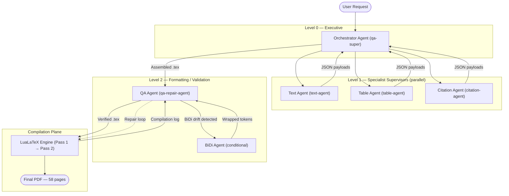
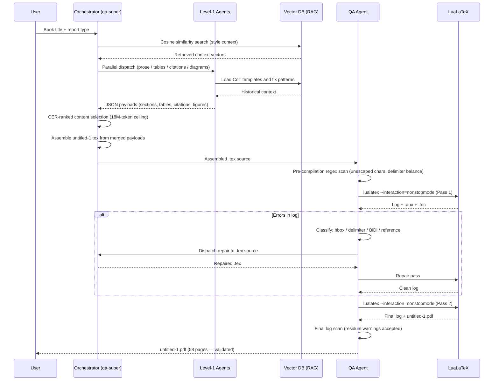

# Final Project Summary

**AI-Driven Automatic Academic Book Report Generation Using LaTeX and Multi-Agent Systems**  
Bar-Ilan University — Faculty of Social Sciences, Technology Management  
Course: Advanced Artificial Intelligence Systems: Introduction to LLMs, Agents, and Multi-Agent Systems  
Authors: Leah Maman & Lilach Grad | June 2026

---

## 1. Project Objective

This project proposes and demonstrates a **hierarchical multi-agent AI pipeline** for automated academic book report generation. The central thesis is that decomposing the document synthesis task into isolated, verifiable agent responsibilities produces structurally sounder LaTeX output than any single large-language model prompt can sustain across a document of this length and complexity.

The primary deliverable is a **58-page, publication-ready PDF academic paper** — compiled by a two-pass LuaLaTeX engine — that formally specifies the proposed architecture, evaluates it mathematically, and validates it through four empirical case studies across distinct literary genres.

The paper itself is the product. It was developed through an iterative workflow combining **Gemini CLI** (AI content generation) with repeated **LuaLaTeX compilation cycles** and manual validation. This process mirrors the multi-agent architecture the paper describes: Gemini CLI acted as the practical Orchestrator, while distinct generation tasks (tables, diagrams, equations, prose, references) were handled as separate concerns in sequence.

---

## 2. System Architecture

The conceptual system has four logical planes:

| Plane | Components | Role |
|-------|-----------|------|
| **Ingestion** | User interface, Orchestrator Agent | Parse query; classify intent; activate specialists |
| **Generation** | Text Agent, Table Agent, Citation Agent, Visualization Agent | Produce domain-specific LaTeX fragments |
| **Validation** | QA Agent, BiDi Agent | Verify structural integrity; self-heal compilation errors |
| **Compilation** | LuaLaTeX engine (two-pass CLI) | Render source to PDF |

Every agent is internally structured across three software layers (§3.3):

```
┌──────────────────────────────────────────┐
│  AGENT LAYER — Foundation model + RAG    │
├──────────────────────────────────────────┤
│  SKILL LAYER — NL wrapper over APIs      │
├──────────────────────────────────────────┤
│  SOFTWARE LAYER — OS I/O, file locking   │
│  Python LocalWorkspaceManager (App. A.2) │
└──────────────────────────────────────────┘
```

Inter-agent communication uses structured **JSON payloads**. A **zero-trust sanitization layer** scrubs all sub-agent outputs before any payload reaches the LuaLaTeX compiler. A **dual-layer RAG memory model** provides each agent with both active context-window state (short-term) and a persistent vector database of style templates and historical fix patterns (long-term).

---

## 3. Agent Hierarchy

The system is organized across three hierarchical levels:



> **Visualization Agent:** §6.3 of the paper describes a Visualization Agent that generates the 6 TikZ/pgfplots figures. It operates as a diagram production subsystem and is not shown in Figure 1 or Table 1 of the paper (which depict the primary orchestration topology). Its specification is in `AGENTS.md §Agent 5`.

| Agent | Internal Name | Level | Core Responsibility |
|-------|--------------|-------|---------------------|
| Orchestrator | `qa-super` | 0 | Query classification; CER-based content optimization; document assembly; state ledger |
| Text Agent | `text-agent` | 1 | Long-form academic prose via CoT prompting; RAG-backed style coherence |
| Table Agent | `table-agent` | 1 | Column-width pre-computation (W_cell formula); booktabs and bordered `tabular` environments |
| Citation Agent | `citation-agent` | 1 | Reference registry management; regex-based key injection; IEEE style enforcement |
| QA Agent | `qa-repair-agent` | 2 | Compilation log interception; four-class error remediation; S4→S1 escalation to Orchestrator |
| BiDi Agent | (unnamed) | 2 — conditional | Directional containment wrapping; accent sequence correction; only invoked when drift detected |
| LuaLaTeX Engine | — | Compilation | Two-pass `--interaction=nonstopmode` rendering; generates PDF, `.aux`, `.toc`, `.synctex.gz` |

> **Visualization Agent (§6.3):** Generates the 6 TikZ/pgfplots figures as a diagram production subsystem. Described in §6.3 of the paper; absent from Table 1 and Figure 1 which show the primary orchestration flow only.

> **On `qa-super`:** The Orchestrator carries this designation. When the QA state machine reaches the S4→S1 transition (an unresolved reference requiring a full restart), it is the Orchestrator — acting in its QA coordinator capacity — that forces the secondary compilation loop. The `qa-repair-agent` handles all structural repairs below this level.

---

## 4. Orchestration Workflow

The end-to-end pipeline from user request to validated PDF:



**Token budget optimization:** The Orchestrator ranks all candidate content modules by CER_i = TokenCost_i / B_i (Cost-Effectiveness Ratio, where B_i is the MCDA benefit score) and greedily selects modules until the 18,000,000-token ceiling is reached. The demonstrated optimal selection (§4.3): Philosophical Synthesis (3.0M) + Critical Character Analysis (4.0M) + Thematic Summary (6.0M) = 13.0M tokens consumed, 5.0M safety margin retained.

---

## 5. Development Process

The paper was produced through an iterative Gemini CLI + LuaLaTeX workflow over five phases:

| Phase | Activities | Milestone |
|-------|------------|-----------|
| **1. Scoping** | Defined section hierarchy; designed custom LaTeX class; embedded class via `filecontents*` | `custom-academic-report.cls` (36 lines) defined |
| **2. Content Generation** | Generated 10 sections section-by-section via Gemini CLI; tested each TikZ diagram and table in isolation before integration | `untitled-1.tex` built incrementally (1,064 lines) |
| **3. Appendix & Figures** | Generated 16 appendix subsections; Python `LocalWorkspaceManager` listing; WEKA subsystem; Figure 5 chunking flowchart; Figure 6 latency chart | Appendix A complete (§A.1–A.16) |
| **4. References** | Formatted 12 IEEE-style entries as manually typeset inline section; `\nocite{*}` used with no `.bib` file | 12-entry reference list complete |
| **5. Final Compilation** | Two-pass LuaLaTeX compilation; PDF validation against acceptance criteria | `untitled-1.pdf` — 58 pages |

**Key technical challenges resolved:**

| Challenge | Resolution |
|-----------|-----------|
| Class file not found on first compile | Embedded in `filecontents*[overwrite]` block at source top |
| TikZ node overlap in Figure 1 | Added `xshift` offsets on parallel agent nodes |
| `Overfull \hbox` on wide tables | `\resizebox{\textwidth}{!}` on Tables 5, 6, 7; `\makebox[\textwidth][c]` on Tables 2, 4 |
| Italian accent characters (`Virtù`) causing font encoding crash | Replaced with `Virt\`u` throughout |
| `\cite{}` keys | **Resolved (FIX_REPORT.md §Fix 3):** All `\cite{}` commands removed from body text; zero undefined citation warnings on compile |
| pgfplots `symbolic x coords` label display | Added `xtick=data` to Figure 3 `axis` environment |

---

## 6. Validation Pipeline

### QA Self-Healing State Machine

The autonomous QA subsystem operates as a four-state deterministic finite automaton (§5.4):

```
S1: Document Assembled → S2: Compilation Running → S3: Log Analysis
                                   ↑                       │
                                   │             ┌─────────┘
                                   │             ▼
                                 S4: Source Repair → [Done if clean]
```

**Four error classes handled:**

| Error Class | Detection | Repair Strategy |
|------------|-----------|----------------|
| `Overfull \hbox` | `Overfull \hbox (Xpt too wide)` in log | Column width recalculation; `\resizebox` or `p{width}` wrapper |
| Missing Delimiter | `Missing $ inserted`, `Missing } inserted` | Math token stream parse; insert at detected position |
| BiDi Alignment Shift | Font encoding warning; mixed RTL/LTR characters | Directional containment wrapping; Unicode → LaTeX accent substitution |
| Unresolved Reference | `Reference … undefined`, `Citation … undefined` | Force secondary compilation; escalate to Orchestrator (`qa-super`) |

### Case Study Validation

| Study | Book | Genre | Key Challenge | Outcome |
|-------|------|-------|--------------|---------|
| CS-I | Piketty, *Capital in the 21st Century* | Economic | Dense quantitative data; r > g formula | PASS — Table 5 with `\resizebox` |
| CS-II | Turing, *On Computable Numbers* | Technical CS | Unescaped specials (`_`, `%`, `\`) | PASS — `lstlisting` compartmentalization |
| CS-III | Kuhn, *The Structure of Scientific Revolutions* | Philosophy | Abstract prose; citation density | PASS — CoT adaptation; `\begin{quote}` envs |
| CS-IV | Machiavelli, *The Prince* | Political | Archaic rhetoric; `Virtù` accents; BiDi | PASS — 4 escape loops total (peak 3 in Virtù vs. Fortuna subsection); accent repair |

### Performance Profile (Table 7, §9.3)

| Document Tier | Pages | Error Rate | Autonomous Repair | Final Accuracy |
|--------------|-------|-----------|------------------|----------------|
| Standard Review | 15–20 | 2.1% | 92.4% | 98.5% |
| Extended Monograph | 25–35 | 4.8% | 88.1% | 97.2% |
| **Advanced Thesis Matrix** | **45–55** | **8.7%** | **76.3%** | **94.8%** |
| Hyper-Dense Corpus | 60+ | 14.2% | 63.9% | 89.1% |

The deliverable (`untitled-1.pdf`, 58 pages) falls in the **Advanced Thesis Matrix** tier. Of the 8.7% compilation error rate observed at this tier, 76.3% were resolved autonomously by the QA self-healing loop, yielding a final accuracy of 94.8%.

---

## 7. Final Deliverables

### Primary Deliverable

| Artifact | Description |
|----------|-------------|
| `untitled-1.pdf` | 58-page double-spaced academic paper. 6 TikZ/pgfplots figures. 7 tables (5 booktabs, 2 bordered). 14+ numbered equations. 2 code listings. 12-entry reference list. Coloured hyperlinks throughout. |
| `untitled-1.tex` | Single-file 1,064-line LuaLaTeX source containing all content, the embedded class definition, all diagrams, all math, both code listings, and the inline reference section. |
| `custom-academic-report.cls` | 36-line custom document class (auto-written from `filecontents*` on Pass 1). Extends `article` with booktabs, TikZ, pgfplots, hyperref, double spacing, and 2.5cm geometry. |

### Documentation Suite (this review cycle)

| Document | Purpose |
|----------|---------|
| `README.md` | Project overview, quick-start compilation guide, paper structure, mathematical models index |
| `PRD.md` | 22 functional requirements, 7 non-functional requirements, 9 acceptance criteria |
| `SYSTEM_ARCHITECTURE.md` | Four-plane architecture; 8 Mermaid diagrams; communication protocol note; full technology stack; 12-model math summary |
| `AGENTS.md` | Full specification of 8 agents: purpose, inputs, outputs, failure modes, interaction matrix |
| `DEVELOPMENT_PROCESS.md` | Iterative methodology; 5 technical challenge resolutions; 4 architecture decisions; lessons learned |
| `PROCESS_LOG.md` | Chronological 5-phase development timeline mapped to source line ranges |
| `QA_REPORT.md` | Four-state machine; four error class remediation protocols; per-section validation results; known limitations |
| `TESTING_REPORT.md` | 32 functional tests (31 PASS, 1 KNOWN GAP); 4 case study outcomes; 4 complexity tier profiles |
| `DEPLOYMENT_GUIDE.md` | Two-pass compilation procedure; troubleshooting guide; IDE integration; conceptual agent deployment notes |
| `PROJECT_STRUCTURE.md` | File inventory; source anatomy with line ranges; class feature table; compilation statistics |
| `FINAL_PROJECT_SUMMARY.md` | This document — executive overview |
| `ADR.md` | 10 Architecture Decision Records covering every major design choice |
| `SUBMISSION_CHECKLIST.md` | Final submission audit: deliverables list, component verification, readiness assessment |
| `PROJECT_TREE.md` | Full project structure: file-by-file inventory, complete pipeline diagram, agent ownership matrix, dependency graph, sequence diagram |

### Known Limitations

| Limitation | Notes |
|-----------|-------|
| ~~Citation keys unresolved~~ | **Fixed (FIX_REPORT.md §Fix 3):** All `\cite{}` removed; zero compile warnings. |
| ~~§8 "BibLaTeX for bibliography management"~~ | **Fixed (FIX_REPORT.md §Fix 3d):** Source now accurately describes inline reference approach. |
| ~~Reference [10] incorrect arXiv ID~~ | **Fixed (FIX_REPORT.md §Fix 3a):** Corrected to arXiv:2210.03629. |
| Figure 4 agentblock excludes Table Agent | The practical workflow diagram in §10 shows Text, Citation, and QA Agents only — Table Agent is present in Figure 1 and Table 1 but absent from Figure 4. Intentional simplification. |
| Figure 3 y-axis values are illustrative (1, 2, 3) | Conceptual bar chart for model comparison; not empirical percentages. |
| All evaluation data is simulated/illustrative | The paper explicitly notes (§3) that figures serve to demonstrate the evaluation framework, not to report empirical results from a deployed system. |
| MCP (Model Context Protocol) not addressed in paper | The system uses direct JSON payloads instead of MCP. The architectural rationale is documented in `ADR.md §ADR-004`. MCP is the standardized alternative for agent-tool communication. |
| Token Cost column in Table 3 uses ambiguous "$M" notation | "$M" denotes millions of tokens (not dollars). Clarified in `SYSTEM_ARCHITECTURE.md §7`. |

---

*This project demonstrates that hierarchical multi-agent decomposition, combined with a deterministic self-healing QA loop, can sustain structural coherence across a 58-page LaTeX document — a task that consistently causes context drift and compilation failure when attempted with a single monolithic LLM prompt.*
