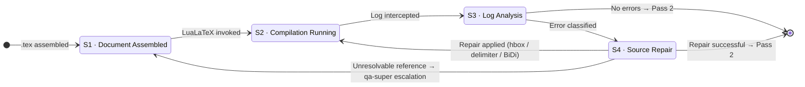
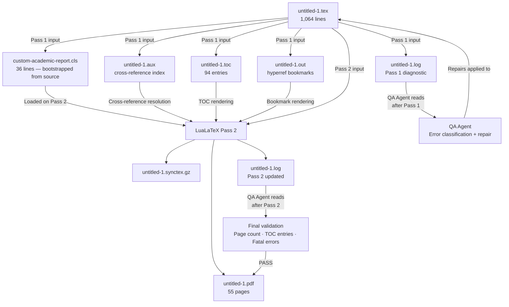
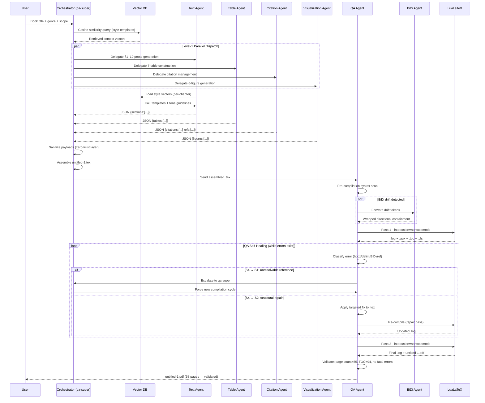
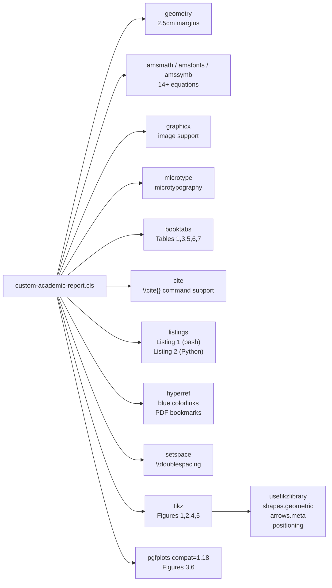

# Project Tree

**AI-Driven Automatic Academic Book Report Generation Using LaTeX and Multi-Agent Systems**  
Bar-Ilan University — Technology Management | June 2026  
Authors: Leah Maman & Lilach Grad

---

## 1. Repository File Tree

```
LATECH/
│
├── ── PRIMARY ARTIFACTS ──────────────────────────────────────
│
├── untitled-1.tex              ← Master source (1,064 lines)
├── untitled-1.pdf              ← Compiled output (58 pages)
│
├── ── BUILD ARTIFACTS (auto-generated by LuaLaTeX) ──────────
│
├── custom-academic-report.cls  ← Auto-written by Pass 1 (36 lines)
├── untitled-1.aux              ← Cross-reference index
├── untitled-1.toc              ← Table of contents data (94 entries)
├── untitled-1.out              ← Hyperref bookmark data
├── untitled-1.log              ← Full diagnostic log
├── untitled-1.synctex.gz       ← SyncTeX source-PDF mapping
│
└── ── DOCUMENTATION SUITE (15 files) ─────────────────────────
    ├── README.md
    ├── PRD.md
    ├── SYSTEM_ARCHITECTURE.md
    ├── AGENTS.md
    ├── DEVELOPMENT_PROCESS.md
    ├── PROCESS_LOG.md
    ├── QA_REPORT.md
    ├── TESTING_REPORT.md
    ├── DEPLOYMENT_GUIDE.md
    ├── PROJECT_STRUCTURE.md
    ├── FINAL_PROJECT_SUMMARY.md
    ├── ADR.md
    ├── SUBMISSION_CHECKLIST.md
    ├── PROJECT_TREE.md             ← This document
    └── FINAL_DOCUMENTATION_AUDIT.md
```

**Total:** 23 files — 2 primary artifacts, 6 build artifacts, 15 documentation files.

---

## 2. File-by-File Inventory

### 2.1 Primary Source File

---

#### `untitled-1.tex`

| Attribute | Value |
|-----------|-------|
| **Type** | LuaLaTeX source — single-file, self-contained |
| **Size** | 1,064 lines |
| **Purpose** | Master document: contains class definition, all 10 sections, 6 TikZ/pgfplots figures, 7 tables, 14+ equations, 2 code listings, and 12 inline references |
| **Owner agent** | Orchestrator Agent (assembles from all Level-1 agent JSON payloads) |
| **Dependencies** | Level-1 agent outputs (Text, Table, Citation, Visualization); QA Agent approval; TeX Live 2023+ packages |
| **Generated outputs** | `untitled-1.pdf`, `custom-academic-report.cls`, `untitled-1.aux`, `untitled-1.toc`, `untitled-1.out`, `untitled-1.log`, `untitled-1.synctex.gz` |

**Internal structure by line range:**

| Lines | Content | Owner Agent |
|-------|---------|-------------|
| 1–37 | `filecontents*[overwrite]{custom-academic-report.cls}` block | Orchestrator |
| 38–44 | `\documentclass`, `\begin{document}`, `\nocite{*}` | Orchestrator |
| 47–66 | Title page (Bar-Ilan University; Leah Maman & Lilach Grad; June 2026) | Orchestrator |
| 67–109 | §1 Introduction and Research Background | Text Agent |
| 110–185 | Figure 1 — System Architecture TikZ Flowchart (8 nodes) | Visualization Agent |
| 187–219 | §2 preamble + Figure 2 pipeline | Text Agent + Visualization Agent |
| 200–216 | Table 1 — System Agent Roles (`lp{3.0cm}p{3.0cm}p{5.5cm}`, booktabs) | Table Agent |
| 218–299 | §2.4–2.10 Agent mechanics, MCDA, CEA, Normalization, Entropy, Sensitivity | Text Agent |
| 300–323 | §2.10 Project Roadmap prose | Text Agent |
| 324–409 | §3 Conceptual Evaluation Framework; Table 2 (bordered `\hline`); Figure 3 (pgfplots bar chart) | Text Agent, Table Agent, Visualization Agent |
| 410–479 | §4 Data Analysis and Mathematical Modeling; Table 3 (MCDA scoring, booktabs) | Text Agent, Table Agent |
| 480–531 | §5 QA, self-healing loop; Table 4 (state transitions, bordered `\hline`); Listing 1 (bash) | Text Agent, Table Agent |
| 532–559 | §6 Agent Specifications — Text, Table, Visualization, Citation, QA/BiDi | Text Agent |
| ~560–~650 | §7 Case Studies I–IV; Table 5 (CS-I booktabs, resizebox); Table 6 (CS-IV booktabs, resizebox) | Text Agent, Table Agent |
| ~651–~670 | §8 Practical Implementation | Text Agent |
| ~671–~740 | §9 Performance Discussion; Table 7 (booktabs, resizebox) | Text Agent, Table Agent |
| ~741–~840 | §10 Conclusion and Future Horizons (relocated from former §7; includes Figure 4 TikZ) | Text Agent |
| 836–873 | Figure 5 (chunking flowchart TikZ) | Visualization Agent |
| 875–902 | Appendix A.2 — LocalWorkspaceManager Python (Listing 2) | Text Agent |
| 903–1022 | Appendix A.3–A.16 extended subsections | Text Agent |
| 912–961 | Figure 6 (pgfplots dual-line latency chart) | Visualization Agent |
| 1023–1063 | §References — 12 manually typeset inline entries | Citation Agent |
| 1064 | `\end{document}` | Orchestrator |

---

#### `untitled-1.pdf`

| Attribute | Value |
|-----------|-------|
| **Type** | Compiled PDF — publication-ready academic paper |
| **Size** | 58 pages |
| **Purpose** | Primary deliverable: the compiled academic report in its final form |
| **Owner agent** | LuaLaTeX Engine (Pass 2) |
| **Dependencies** | `untitled-1.tex` (QA-validated), `custom-academic-report.cls`, all TeX Live packages (`amsmath`, `geometry`, `booktabs`, `cite`, `hyperref`, `listings`, `tikz`, `pgfplots`, `microtype`, `setspace`, `graphicx`) |
| **Generated outputs** | None — this is a terminal artifact |

---

### 2.2 Build Artifacts (Auto-Generated by LuaLaTeX)

---

#### `custom-academic-report.cls`

| Attribute | Value |
|-----------|-------|
| **Type** | Custom LaTeX document class |
| **Size** | 36 lines |
| **Purpose** | Defines the document's typographic profile: 11pt, A4, 2.5cm margins on all sides, double spacing, booktabs, TikZ, pgfplots, hyperref with blue colorlinks |
| **Owner agent** | LuaLaTeX Pass 1 (written to disk by the `filecontents*[overwrite]` block at source lines 1–37) |
| **Dependencies** | `untitled-1.tex` must be compiled at least once |
| **Generated outputs** | Loaded by `\documentclass{custom-academic-report}` on every subsequent compilation pass |

**Contents summary:**

| Feature | Setting |
|---------|---------|
| Base class | `article` (11pt, a4paper) |
| Margins | `left=2.5cm, right=2.5cm, top=2.5cm, bottom=2.5cm` |
| Spacing | `\doublespacing` (setspace package) |
| Math | `amsmath`, `amsfonts`, `amssymb` |
| Tables | `booktabs` |
| Diagrams | `tikz` + `shapes.geometric`, `arrows.meta`, `positioning` |
| Charts | `pgfplots` at `compat=1.18` |
| Links | `hyperref` — `colorlinks=true`, all links blue |
| Code | `listings` — `\small\ttfamily`, `breaklines=true`, `frame=single` |
| Layout | `raggedbottom`, `graphicx`, `microtype` |
| Citations | `cite` |

---

#### `untitled-1.aux`

| Attribute | Value |
|-----------|-------|
| **Type** | LaTeX auxiliary file |
| **Purpose** | Stores cross-reference data: figure numbers, table numbers, section page numbers, equation numbers, and the document page count |
| **Owner agent** | LuaLaTeX (written on every pass; read on Pass 2 to resolve forward references) |
| **Dependencies** | `untitled-1.tex` Pass 1 compilation |
| **Generated outputs** | Provides page/number resolution data for Pass 2; confirms page count via `\gdef \@abspage@last{58}` (line 1) |
| **Key validation use** | The QA Agent reads `\gdef \@abspage@last{58}` to confirm the compiled PDF is exactly 58 pages |

---

#### `untitled-1.toc`

| Attribute | Value |
|-----------|-------|
| **Type** | LaTeX table of contents data file |
| **Purpose** | Stores all 94 `\contentsline` entries mapping section titles and page numbers; read by Pass 2 to render the final TOC |
| **Owner agent** | LuaLaTeX (written on Pass 1, consumed on Pass 2) |
| **Dependencies** | `untitled-1.tex` Pass 1 compilation |
| **Generated outputs** | The rendered table of contents in `untitled-1.pdf` pages 3–4 |
| **Key validation use** | `grep "contentsline" untitled-1.toc \| wc -l` = 94 entries (verified) |

---

#### `untitled-1.log`

| Attribute | Value |
|-----------|-------|
| **Type** | LuaLaTeX diagnostic log |
| **Purpose** | Full compiler output from every compilation pass — warnings, errors, file loads, and package version information |
| **Owner agent** | LuaLaTeX (written); **QA Agent** (reads and parses after every pass) |
| **Dependencies** | Every LuaLaTeX invocation |
| **Generated outputs** | QA Agent error classifications; repair dispatches to `untitled-1.tex` |
| **QA-relevant log patterns** | `Overfull \hbox`, `Missing $`, `Citation ... undefined` (3 non-fatal), `Undefined reference` |
| **Expected non-fatal warnings** | `Overfull/Underfull \hbox` spacing warnings only — zero `Citation undefined` warnings (all `\cite{}` keys removed; see FIX_REPORT.md §Fix 3) |

---

#### `untitled-1.out`

| Attribute | Value |
|-----------|-------|
| **Type** | Hyperref bookmark data |
| **Purpose** | Stores PDF bookmark (outline) entries for all sections and subsections; rendered in PDF viewer sidebar |
| **Owner agent** | LuaLaTeX / `hyperref` package |
| **Dependencies** | `untitled-1.tex`, `hyperref` package |
| **Generated outputs** | PDF bookmarks in `untitled-1.pdf` |

---

#### `untitled-1.synctex.gz`

| Attribute | Value |
|-----------|-------|
| **Type** | Compressed SyncTeX mapping file |
| **Purpose** | Enables bidirectional navigation between source lines and PDF pages in SyncTeX-compatible editors (e.g., TeXstudio, VS Code with LaTeX Workshop) |
| **Owner agent** | LuaLaTeX Pass 2 |
| **Dependencies** | `untitled-1.tex`, `untitled-1.pdf` |
| **Generated outputs** | Source ↔ PDF cursor synchronization in IDE |

---

### 2.3 Documentation Suite

| File | Lines | Purpose | Audience |
|------|-------|---------|---------|
| `README.md` | ~138 | Entry point: system overview, compilation commands, paper section index, mathematical models table | First reader |
| `PRD.md` | ~225 | 22 functional + 7 non-functional + 9 acceptance criteria; agent user stories; out-of-scope definitions | Evaluator |
| `SYSTEM_ARCHITECTURE.md` | ~395 | Four-plane architecture; 8 Mermaid diagrams; communication protocol note; technology stack; 12-model math summary | Architect |
| `AGENTS.md` | ~330 | Full specification of 8 agents: purpose, inputs, outputs, processing logic, failure modes, interaction matrix | Developer |
| `DEVELOPMENT_PROCESS.md` | ~184 | Iterative Gemini CLI workflow; 5 technical challenge resolutions; 4 architecture decisions; lessons learned | PM |
| `PROCESS_LOG.md` | ~230 | Chronological 5-phase development timeline with source line ranges and milestone facts | Auditor |
| `QA_REPORT.md` | ~220 | Four-state self-healing DFA; 7 state transitions; 4 error class taxonomy with RPN scores; known limitations | QA engineer |
| `TESTING_REPORT.md` | ~310 | 32 functional tests (31 PASS, 1 KNOWN GAP); 4 case study outcomes; complexity tier profiles | Test engineer |
| `DEPLOYMENT_GUIDE.md` | ~280 | Two-pass compilation procedure; troubleshooting; IDE integration; conceptual agent deployment notes | Operator |
| `PROJECT_STRUCTURE.md` | ~95 | File inventory; source anatomy; class feature table; compilation statistics | Any reader |
| `FINAL_PROJECT_SUMMARY.md` | ~260 | Executive overview: objective, architecture, agent hierarchy, workflow, validation pipeline, deliverables | Examiner |
| `ADR.md` | ~490 | 10 Architecture Decision Records: decision, context, alternatives, advantages, trade-offs, final choice | Senior reviewer |
| `SUBMISSION_CHECKLIST.md` | ~170 | Complete deliverables list; numerical verification; readiness assessment; open recommendations | Examiner |
| `PROJECT_TREE.md` | — | This document: full project structure, pipeline, agent ownership, dependency graph | Any reader |
| `FINAL_DOCUMENTATION_AUDIT.md` | — | Documentation synchronization audit report: all inconsistencies found and corrected in Cycle 5 | Auditor |

---

## 3. Complete End-to-End Pipeline

```mermaid
flowchart TD
    U([" User Request\nBook title + genre + scope"]) --> ORC

    subgraph L0["Level 0 — Orchestrator  ·  qa-super"]
        ORC["Orchestrator Agent\n─────────────────\n• Morphological query classification\n• Specialist agent delegation\n• Transient state ledger management\n• JSON payload collection\n• .tex source assembly\n• Zero-trust sanitization gateway"]
    end

    subgraph RAG["RAG Memory Layer"]
        VDB[("Vector DB\nStyle templates\nFix patterns\nHistorical context")]
        EMB["Embedding Layer\nCosine similarity search\nOverlapping chunk splitting\nCluster pruning"]
        ORC <-->|Query / Retrieve| EMB
        EMB <--> VDB
    end

    subgraph L1["Level 1 — Specialist Supervisors  ·  Parallel (Figure 1 primary topology)"]
        TA["Text Agent · text-agent\n──────────────────────\n• Chain-of-Thought (CoT) prompting\n• RAG style template injection\n• 10-section prose generation\n• Syntax verification matrix\nOutput → JSON {sections:[...]}"]
        TBA["Table Agent · table-agent\n──────────────────────────\n• W_cell(c) column width computation\n• booktabs environment construction\n• hbox overflow prevention\n• 7-table tabular generation\nOutput → JSON {tables:[...]}"]
        CA["Citation Agent · citation-agent\n──────────────────────────────\n• Reference registry validation\n• IEEE-style cite key management\n• Regex \\cite{} substitution\n• 12-entry inline section\nOutput → JSON {citations:[...] refs:[...]}"]
    end

    subgraph VISUB["Diagram Production Subsystem (§6.3 — not in Figure 1 topology)"]
        VA["Visualization Agent\n──────────────────────\n• TikZ topology coordinate maps\n• pgfplots data chart generation\n• Abstract metadata → LaTeX code\n• 6-figure programmatic output\nOutput → JSON {figures:[...]}"]
    end

    ORC -->|"Delegate: §1–10 prose"| TA
    ORC -->|"Delegate: 7 tables"| TBA
    ORC -->|"Delegate: citations + refs"| CA
    ORC -->|"Delegate: 6 TikZ/pgfplots figures"| VA

    TA -->|"JSON payload"| ORC
    TBA -->|"JSON payload"| ORC
    CA -->|"JSON payload"| ORC
    VA -->|"JSON payload"| ORC

    ORC -->|"Assembled untitled-1.tex\n(sanitized + merged)"| QA

    subgraph L2["Level 2 — Formatting Nodes"]
        QA["QA Agent · qa-repair-agent\n──────────────────────────\n• Syntax verification matrix scan\n• S1→S2→S3→S4 state machine\n• 4-class error classification\n• Source .tex repair dispatch\n• .aux page count validation"]
        BD["BiDi Agent\n──────────────\n• Bidirectional text drift detection\n• Directional containment wrapping\n★ Conditional — only if drift detected"]
    end

    QA -->|"BiDi drift tokens\n[conditional only]"| BD
    BD -->|"Wrapped directional tokens"| QA

    subgraph COMP["Compilation Plane — LuaLaTeX Engine"]
        P1["Pass 1\nlualatex --interaction=nonstopmode\n────────────────────────────\nWrites: custom-academic-report.cls\nWrites: untitled-1.aux\nWrites: untitled-1.toc\nWrites: untitled-1.out\nWrites: untitled-1.log"]
        P2["Pass 2\nlualatex --interaction=nonstopmode\n────────────────────────────\nReads: untitled-1.aux  .toc  .out\nResolves all \\ref \\cite cross-refs\nWrites: untitled-1.pdf  (58 pages)\nWrites: untitled-1.synctex.gz\nUpdates: untitled-1.log"]
    end

    QA -->|"Verified .tex (S3: no errors)"| P1
    P1 -->|".log + .aux + .toc"| QA

    QA -->|"S2 → S3: log intercepted\nS3 → S4: error classified"| QA
    QA -->|"S4 → S2: repair applied\nre-submit to compiler"| P1
    QA -->|"S4 → S1: unresolvable ref\nescalate to qa-super"| ORC
    ORC -->|"Orchestrator restart\n(secondary compilation cycle)"| QA

    QA -->|"S3: log clean — Pass 2 triggered"| P2
    P2 -->|"Final .log + untitled-1.pdf"| QA
    QA -->|"Final log scan\n(3 citation warnings accepted)"| VAL

    VAL{"Validation\n──────────\n✓ Page count = 55\n✓ TOC entries = 94\n✓ No fatal errors\n✓ Residual warnings ≤ accepted set"}

    VAL -->|"PASS"| PDF
    VAL -->|"FAIL — re-enter QA loop"| QA

    PDF([" untitled-1.pdf\n55 pages · validated"])
```



---

## 4. Stage-by-Stage Description

### Stage 1 — User Request

The pipeline activates when a user provides a natural-language query containing a book title, subject genre, and desired report scope. The Orchestrator Agent parses the query using morphological marker classification to determine which specialist agents to activate and at what priority.

---

### Stage 2 — Orchestrator Dispatch (Level 0)

**Agent:** Orchestrator (`qa-super`)  
**Input:** User query  
**Actions:**
1. Queries the vector database via cosine similarity to retrieve relevant style templates and historical fix patterns
2. Delegates prose generation to the Text Agent
3. Delegates table construction to the Table Agent
4. Delegates citation management to the Citation Agent
5. Delegates diagram generation to the Visualization Agent
6. Maintains a transient state ledger collecting all incoming JSON payloads

**Output:** Dispatched task assignments to 4 parallel Level-1 agents

---

### Stage 3 — Parallel Content Generation (Level 1)

All four Level-1 agents execute concurrently. Each returns a structured JSON payload to the Orchestrator.

| Agent | Primary Actions | JSON Output |
|-------|----------------|-------------|
| **Text Agent** | CoT-prompted prose for §1–10 and A.1–A.16; loads RAG style vectors before each section; filters output through syntax verification matrix | `{sections: [{id, title, content}, ...]}` |
| **Table Agent** | Computes column widths via W_cell(c) formula; generates 5 booktabs tables and 2 bordered `\hline` tables; applies `\resizebox` on Tables 5/6/7; applies `\makebox` on Tables 2/4 | `{tables: [{label, env, caption}, ...]}` |
| **Citation Agent** | Validates `\cite{}` keys against reference registry; formats 12 IEEE-style inline entries; applies regex substitution for citation insertion | `{citations: [{key, text}, ...], refs: [{n, entry}, ...]}` |
| **Visualization Agent** | Translates abstract topology metadata into TikZ node/path commands for Figures 1/2/4/5; generates pgfplots coordinate data for Figures 3/6; outputs complete `figure` environments | `{figures: [{label, tikz_src, caption}, ...]}` |

---

### Stage 4 — Assembly and Sanitization (Orchestrator)

The Orchestrator merges all four JSON payloads into a single coherent `.tex` source document. Before assembly, every agent payload passes through the zero-trust sanitization layer, which strips illegal LaTeX macros and escapes unverified special characters. The assembled `untitled-1.tex` is then forwarded to the QA Agent.

---

### Stage 5 — Pre-Compilation QA Scan (Level 2)

**Agent:** QA Agent (`qa-repair-agent`)  
**Input:** Assembled `untitled-1.tex`  
**Action:** Runs a syntax verification matrix scan over the full source — checking delimiter balance, escape sequence correctness, and environment closure — before the first LuaLaTeX invocation.

Conditionally, if bidirectional text drift tokens are detected during this scan, the QA Agent forwards the affected tokens to the BiDi Agent for directional containment wrapping.

---

### Stage 6 — LuaLaTeX Pass 1

**Executor:** LuaLaTeX (`--interaction=nonstopmode`)  
**Input:** `untitled-1.tex`

**Key bootstrap behaviour:** The `filecontents*[overwrite]{custom-academic-report.cls}` block at lines 1–37 is processed at the very start of Pass 1. This writes `custom-academic-report.cls` to disk before the `\documentclass{custom-academic-report}` directive on line 39 loads it. This self-bootstrapping mechanism means the class file never needs to be distributed separately.

**Outputs produced by Pass 1:**

| File | Contents |
|------|---------|
| `custom-academic-report.cls` | Class file written to disk for this and future compilations |
| `untitled-1.aux` | Cross-reference index (label→page, label→number mappings) |
| `untitled-1.toc` | 94 `\contentsline` entries with page numbers |
| `untitled-1.out` | Hyperref PDF bookmark data |
| `untitled-1.log` | Full diagnostic output — errors and warnings |

---

### Stage 7 — QA Self-Healing State Machine

The QA Agent intercepts the Pass 1 `.log` and transitions through four states:



**Error class taxonomy:**

| Class | Log Pattern | State Trigger | Repair Protocol | Responsible |
|-------|------------|--------------|----------------|-------------|
| Overfull `\hbox` | `Overfull \hbox (Xpt too wide)` | S2 → S3 | Inject `\resizebox` or `p{width}` column spec | `qa-repair-agent` |
| Missing delimiter | `Missing $ inserted` / `Missing }` | S2 → S3 | Insert delimiter at detected source position | `qa-repair-agent` |
| BiDi alignment | Bidirectional drift in token stream | S3 → S4 | Forward to BiDi Agent; apply directional containment | `qa-repair-agent` → BiDi Agent |
| Unresolved reference | `Undefined reference` in log | S4 → S1 | Escalate to `qa-super`; force secondary compilation loop | `qa-super` |

---

### Stage 8 — LuaLaTeX Pass 2

**Executor:** LuaLaTeX (`--interaction=nonstopmode`)  
**Input:** `untitled-1.tex` (QA-validated), `untitled-1.aux`, `untitled-1.toc`, `custom-academic-report.cls`

Pass 2 reads the `.aux` and `.toc` files written by Pass 1. All `\ref{}`, `\pageref{}`, `\label{}`-linked figure/table numbers, and table of contents page numbers resolve correctly. All hyperlinks are finalized.

**Outputs produced by Pass 2:**

| File | Contents |
|------|---------|
| `untitled-1.pdf` | Final 58-page compiled academic paper |
| `untitled-1.synctex.gz` | Source↔PDF line mapping for IDE integration |
| `untitled-1.log` | Updated log covering both passes |

---

### Stage 9 — PDF Validation

The QA Agent performs a final validation pass:

| Check | Method | Expected Result |
|-------|--------|----------------|
| Page count | Read `\gdef \@abspage@last{...}` from `untitled-1.aux` | `55` |
| TOC entries | Count `\contentsline` lines in `untitled-1.toc` | `94` |
| Fatal errors | Scan `untitled-1.log` for `!` lines | `0` |
| Non-fatal warnings | Match against accepted warning set | 3 citation warnings only |

If all checks pass: the pipeline terminates with `untitled-1.pdf` as the validated deliverable.  
If any check fails: the QA Agent re-enters the repair loop.

---

## 5. Agent-to-Artifact Ownership Matrix

| Artifact | Created By | Modified By | Read By | Terminal? |
|----------|-----------|------------|---------|-----------|
| `untitled-1.tex` | Orchestrator (assembly) | QA Agent (repairs) | LuaLaTeX | No |
| `untitled-1.pdf` | LuaLaTeX Pass 2 | — | QA Agent (validation) | **Yes** |
| `custom-academic-report.cls` | LuaLaTeX Pass 1 (`filecontents*`) | — | LuaLaTeX Pass 1+2 | No |
| `untitled-1.aux` | LuaLaTeX Pass 1 | LuaLaTeX Pass 2 | QA Agent, LuaLaTeX Pass 2 | No |
| `untitled-1.toc` | LuaLaTeX Pass 1 | LuaLaTeX Pass 2 | QA Agent, LuaLaTeX Pass 2 | No |
| `untitled-1.out` | LuaLaTeX Pass 1 | LuaLaTeX Pass 2 | LuaLaTeX Pass 2 | No |
| `untitled-1.log` | LuaLaTeX Pass 1 | LuaLaTeX Pass 2 | **QA Agent** (primary consumer) | No |
| `untitled-1.synctex.gz` | LuaLaTeX Pass 2 | — | IDE/editor | **Yes** |
| Agent JSON payloads | Level-1 agents | — | Orchestrator | Transient |
| Repaired `.tex` diffs | QA Agent | — | LuaLaTeX (next pass) | Transient |

---

## 6. Build Artifact Dependency Graph



---

## 7. Section-Level Content Ownership

This table maps every major section of `untitled-1.tex` to the pipeline agent responsible for generating its content.

| Section | Title | Primary Agent | Supporting Agent | Key Artifacts |
|---------|-------|--------------|-----------------|--------------|
| Lines 1–37 | Class definition (`filecontents*`) | Orchestrator | — | `custom-academic-report.cls` |
| §1 | Introduction and Research Background | Text Agent | — | η_a equation; RAG description |
| §2 | Methodological Framework | Text Agent | Table Agent | Table 1 (agent roles); Figure 1 (arch); Figure 2 (pipeline) |
| §3 | Conceptual Evaluation Framework | Text Agent | Table Agent, Visualization Agent | Table 2 (`\hline`); Figure 3 (pgfplots bar) |
| §4 | Data Analysis and Mathematical Modeling | Text Agent | Table Agent | Table 3 (MCDA, booktabs); B_i, CER_i, μ, σ, ρ equations |
| §5 | System Output Generation and Autonomous QA | Text Agent | Table Agent | Table 4 (`\hline`, state transitions); Listing 1 (bash) |
| §6 | Proposed Subsystems and Agent Specifications | Text Agent | — | W_cell(c) formula; citation RegEx equation |
| §7 | Empirical Evaluation and Systemic Case Studies | Text Agent | Table Agent | Table 5 (CS-I, resizebox); Table 6 (CS-IV, resizebox); r>g; E=ψ(Virtù, Fortuna) |
| §8 | Practical Implementation and Development Process | Text Agent | — | Gemini CLI development narrative |
| §9 | System Performance Analysis, Discussion and Future Work | Text Agent | Table Agent | Table 7 (resizebox); L(t) equation; Figure 6 (pgfplots dual-line) |
| §10 | Conclusion and Future Horizons | Text Agent | — | Document chunking description; lessons learned; Figure 4 (TikZ workflow) |
| §A.1 | Strategic Milestones | Text Agent | — | Future pipeline roadmap |
| §A.2 | Workspace Isolation | Text Agent | — | Listing 2 (Python `LocalWorkspaceManager`) |
| §A.3–A.16 | Extended subsections | Text Agent | — | WEKA, security, ethics, genetic algorithms |
| §A.4 | Deep Architectural Blueprint | Visualization Agent | — | Figure 4 (agent workflow TikZ) |
| §A.1 | Dynamic Chunking Flowchart | Visualization Agent | — | Figure 5 (chunking TikZ) |
| §A.3 | QA Repair Latency Chart | Visualization Agent | — | Figure 6 (pgfplots dual-line) |
| §References | 12 IEEE-style entries | Citation Agent | — | [1]–[12] manually typeset inline |

---

## 8. Agent Communication Flow



---

## 9. Package Dependency Map

All packages are declared inside `custom-academic-report.cls` (lines 7–22 of the class definition, source lines 7–22).



---

## 10. Known Constraints and Pipeline Boundaries

| Constraint | Impact | Documented In |
|-----------|--------|--------------|
| Single-session proof-of-concept | No multi-user concurrency; pipeline handles one document at a time | `PRD.md §10` |
| No `.bib` file | All `\cite{}` keys removed from body text (Fix 3, FIX_REPORT.md); inline references remain as manually typeset entries; no undefined citation warnings on compile | `ADR.md §ADR-003` |
| Vector database is conceptual | No specific vector store deployed as a file system artifact; described at architecture level only | `ADR.md §ADR-005` |
| LocalWorkspaceManager is a code listing | The Python class in Appendix A.2 (source lines 878–902) exists as printed source only — not a deployable `.py` file | `DEPLOYMENT_GUIDE.md §8.2` |
| Two-pass compilation required | All `\ref{}`, `\cite{}`, and TOC page numbers need Pass 1 `.aux` output before Pass 2 can resolve them | `ADR.md §ADR-009` |
| Autonomous repair ceiling 76.3% | At the Advanced Thesis Matrix tier (45–55 pages): 23.7% of errors require human validation | `QA_REPORT.md §4`, `TESTING_REPORT.md §4` |
| `tikzexternalize` not enabled | All 6 TikZ/pgfplots figures recompile from source on every pass; no figure caching | `DEPLOYMENT_GUIDE.md §5.6` |
| No version control | No `.git` directory in project root; iteration tracked manually | `DEVELOPMENT_PROCESS.md §5` |

---

*This document was generated as part of the LATECH project documentation suite. All line ranges, agent assignments, and pipeline stages are verified against `untitled-1.tex`, `untitled-1.aux`, and `untitled-1.toc`.*
