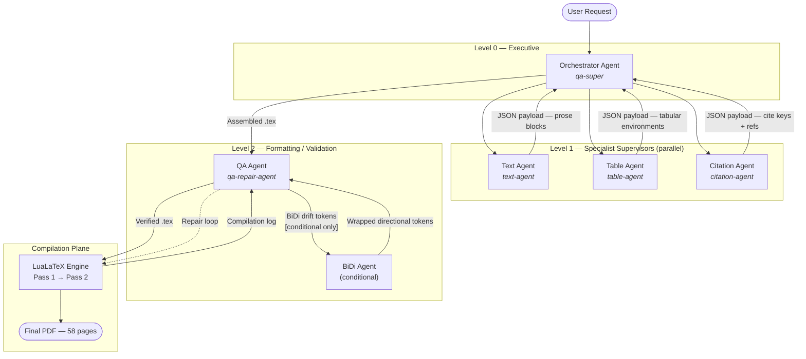
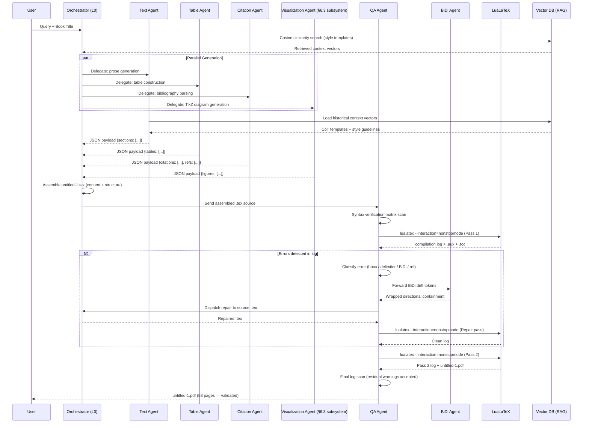
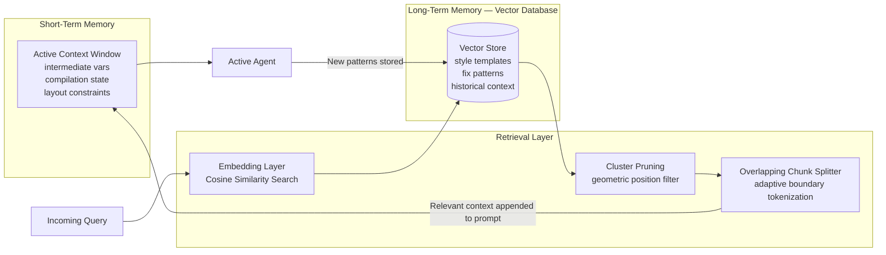
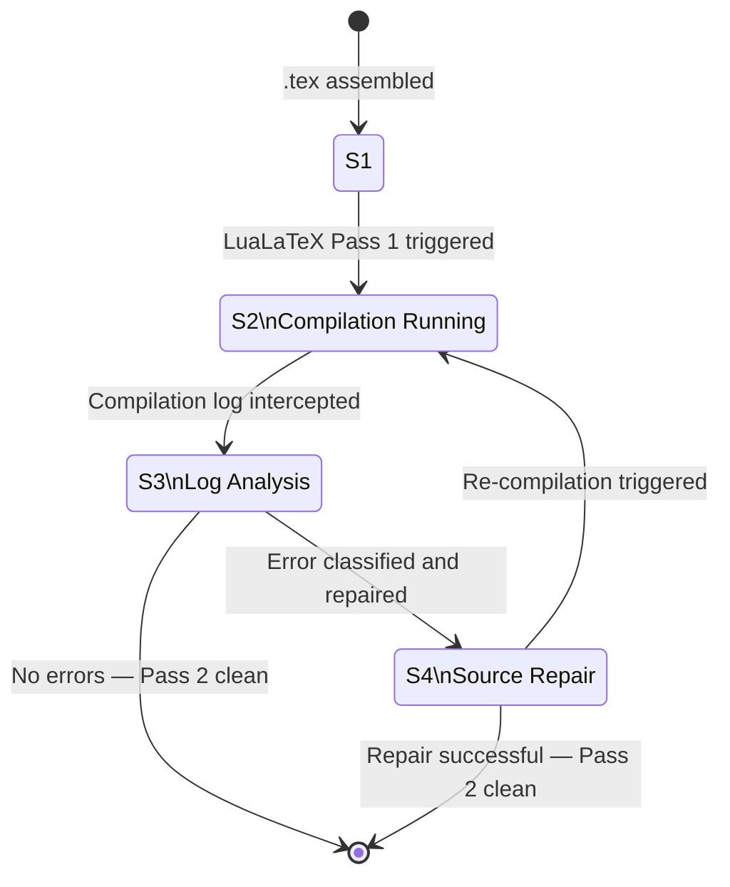
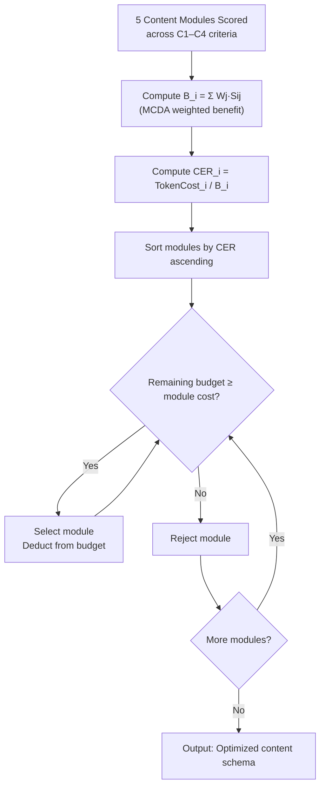
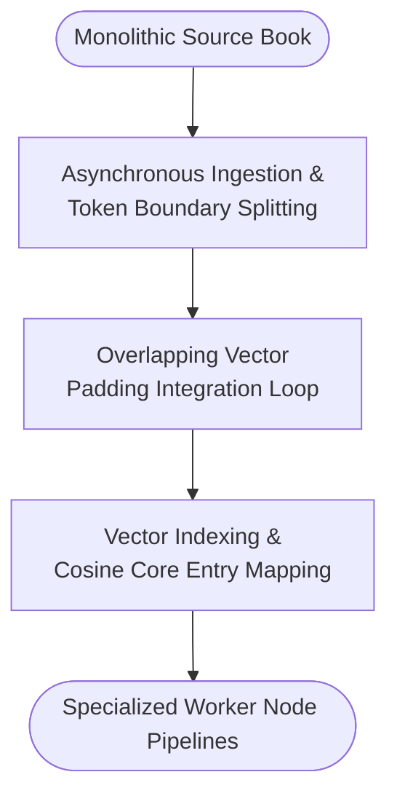
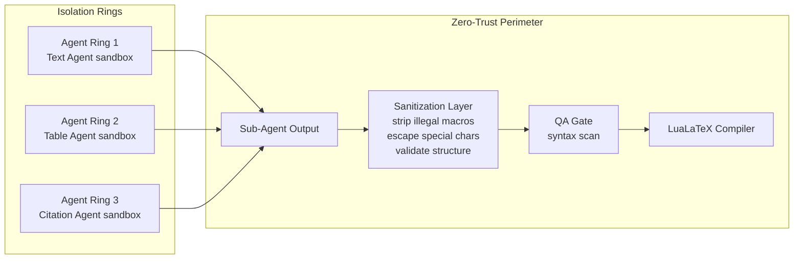
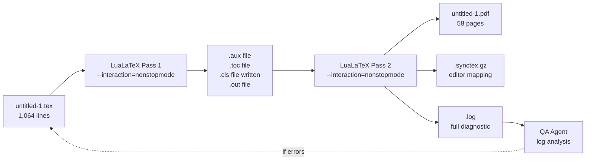

# System Architecture

**AI-Driven Automatic Academic Book Report Generator**  
Version 1.0 — Proof of Concept | Bar-Ilan University, June 2026

---

## 1. Architecture Overview

The system is a **hierarchical multi-agent orchestration pipeline** that transforms a natural-language user query into a compiled, publication-ready LaTeX/PDF academic report. It is designed around the **ReAct** (Reasoning and Acting) paradigm: each agent reasons about its local context, executes an action, observes the result, and iterates.

The pipeline has four logical planes:

| Plane | Components | Responsibility |
|-------|-----------|----------------|
| **Ingestion Plane** | User interface, Orchestrator Agent | Parse user query; activate specialist agents |
| **Generation Plane** | Text Agent, Table Agent, Citation Agent; + Visualization Agent (§6.3 diagram production subsystem) | Produce domain-specific LaTeX content (prose, tables, citations, TikZ/pgfplots figures) |
| **Validation Plane** | QA Agent, BiDi Agent, qa-repair-agent | Verify structural integrity; self-heal errors |
| **Compilation Plane** | LuaLaTeX engine (two-pass CLI) | Render source to PDF |

---

## 2. Three-Layer Agent Model

Every agent in the system is structured across three internal software layers (§3.3):

```
┌────────────────────────────────────────────┐
│              AGENT LAYER (Level N)          │
│  Foundation model + context window + RAG    │
│  Semantic search via cosine similarity      │
├────────────────────────────────────────────┤
│              SKILL LAYER                    │
│  NL wrapper over programmatic APIs/SDKs     │
│  Injects stylistic intent into templates    │
├────────────────────────────────────────────┤
│              SOFTWARE LAYER                 │
│  OS-level I/O, file locking, workspace mgmt │
│  Python LocalWorkspaceManager (Appendix A.2)│
└────────────────────────────────────────────┘
```

---

## 3. Hierarchical Agent Topology

The primary orchestration topology matches Figure 1 and Table 1 of the paper:



> **Visualization Agent note:** The Visualization Agent (§6.3 of the paper) generates the 6 TikZ/pgfplots figures as a diagram production subsystem. It is a real component of the system but is not represented in Figure 1 or Table 1 of the paper — both use a selective topology showing the primary orchestration flow. Its full specification is documented in `AGENTS.md §Agent 5`.

---

## 4. End-to-End Processing Pipeline



---

## 5. Memory Architecture (RAG)

The system implements a dual-layer memory model (§1.4):



**Retrieval flow:**
1. Monolithic source book split into overlapping chunks at character boundaries.
2. Each chunk embedded and indexed into the vector store.
3. Incoming query triggers cosine similarity search.
4. Retrieved chunks undergo adaptive cluster pruning to eliminate redundant vectors.
5. Top-k chunks appended to the agent's active prompt.

---

## 6. QA Self-Healing State Machine

The Quality Assurance subsystem operates as a four-state deterministic finite automaton (§5.4):



**State transition triggers and responsible agents (Table 4 in paper):**

| Transition | Trigger | Agent | RPN Remediation |
|------------|---------|-------|----------------|
| S1 → S2 | Assembled `.tex` passed to LuaLaTeX | Orchestrator | — |
| S2 → S3 | Compiler exits; log parsed | QA Agent | — |
| S3 → S4 (hbox) | `Overfull \hbox` detected | `qa-repair-agent` | Horizontal scaling or p{width} |
| S3 → S4 (delim) | Missing `$` or `}` detected | `qa-repair-agent` | Token insertion at detected position |
| S3 → S4 (BiDi) | Bidirectional text drift detected | `qa-repair-agent` | Directional containment wrapping |
| S4 → S1 (ref) | `Undefined reference` in log | `qa-super` | Force secondary compilation loop |

---

## 7. Token Budget Optimization

The Orchestrator implements a **greedy Cost-Effectiveness Ratio (CER)** scheduler (§2.6, §4.3):



**Demonstrated optimal selection (§4.3):**

| Selection | Module | Token Cost | B_i | Remaining Budget |
|-----------|--------|-----------|-----|-----------------|
| 1st | Philosophical Synthesis | 3.0M | 69.00 | 15.0M |
| 2nd | Critical Character Analysis | 4.0M | 76.25 | 11.0M |
| 3rd | Thematic Summary Module | 6.0M | 83.25 | 5.0M |
| — | Historical Context Matrix | 5.5M | 70.25 | **REJECTED** (5.0M < 5.5M) |
| — | Comparative Literary Loop | 8.0M | 80.25 | **REJECTED** (budget depleted) |

**Result:** 13.0M tokens consumed; aggregate B = 228.5; 5.0M safety pad maintained.

> **Token cost units:** In Table 3 of the paper, the column header reads "Token Cost ($M)". The `$M` notation denotes **millions of tokens** (e.g., 3.0M = 3,000,000 tokens), not a monetary amount. The dollar sign is a LaTeX typographic artefact from the escaped `\$` command used in the column header.

---

## 8. Communication Protocol

All inter-agent communication uses **structured JSON payloads** over dedicated per-agent channels. This design was deliberately chosen over a standardized protocol.

| Design Choice | Rationale |
|--------------|-----------|
| **Direct JSON payloads (implemented)** | Zero broker dependency; payload schema is fully controlled; sanitization applied at the Orchestrator boundary before any output reaches the compiler. |
| **Model Context Protocol (MCP) — alternative** | MCP is the standardized protocol for agent-tool and agent-context communication. It provides a formalized interface for tool invocation, context management, and sampling. Adopting MCP would improve interoperability with external tool ecosystems but would introduce a broker dependency and require the pipeline to be redesigned around MCP server/client roles. |

The full architectural rationale for this choice is documented in `ADR.md §ADR-004`.

---

## 9. Workspace Management

The Software Layer uses a Python `LocalWorkspaceManager` class (Appendix A.2) for session-isolated workspace management:

```python
class LocalWorkspaceManager:
    def __init__(self, base_path="./workspace"):
        self.base_path = base_path
        if not os.path.exists(self.base_path):
            os.makedirs(self.base_path)

    def write_agent_artifact(self, session_id: str, file_name: str, content: str) -> str:
        session_dir = os.path.join(self.base_path, session_id)
        if not os.path.exists(session_dir):
            os.makedirs(session_dir)
        target_file = os.path.join(session_dir, file_name)
        with open(target_file, "w", encoding="utf-8") as f:
            f.write(content)
        return target_file

    def purge_temporary_artifacts(self, session_id: str):
        session_dir = os.path.join(self.base_path, session_id)
        if os.path.exists(session_dir):
            shutil.rmtree(session_dir)
            print(f"Workspace boundary [{session_id}] cleansed successfully.")
```

**Key invariants:**
- Each session isolated under `./workspace/{session_id}/`
- OS-level file locks prevent race conditions between parallel agents
- Temporary artifacts purged once PDF passes validation

---

## 10. Document Chunking Pipeline (RAG Ingestion)



**Design rationale (§7.3):** Overlapping boundaries ensure multi-chapter sub-narratives are contextually preserved at chunk perimeters, preventing context dilution when passages span the split point.

---

## 11. Security Architecture

The system implements a **zero-trust validation topology** (§2.3):



| Boundary | Control | Mechanism |
|----------|---------|-----------|
| Sub-agent → Orchestrator | Input sanitization | Payloads scrubbed for illegal macros, unescaped characters |
| Orchestrator → Compiler | Output validation | QA syntax scan before every `lualatex` invocation |
| Agent ↔ Agent | Isolated channels | Dedicated message channel per agent pair; no global broadcast |
| Execution environments | Logical isolation | Each agent's output validated before reaching compiler (proof-of-concept scope; no OS-level containers deployed) |

---

## 12. Compilation Architecture



**Notable compilation features:**
- `filecontents*[overwrite]` block auto-writes `custom-academic-report.cls` during Pass 1
- `\nocite{*}` in preamble signals all reference entries for bibliography
- Double-pass mandatory: Pass 1 writes `.aux`/`.toc`; Pass 2 resolves forward references
- All `\cite{}` keys removed from body text (FIX_REPORT.md §Fix 3); inline reference list retained; zero undefined citation warnings on compile

---

## 13. Mathematical Models Summary

| Model | Formula | Agent Owner | Section |
|-------|---------|------------|---------|
| Agentic Efficiency | η_a = Σ (A_{c,i} · log(C_w)) / (T_s · Δt_i) | Orchestrator | §1.3 |
| MCDA Benefit Score | B_i = Σ W_j · S_ij | Orchestrator | §2.5 |
| Cost-Effectiveness Ratio | CER_i = TokenCost_i / B_i | Orchestrator | §2.6 |
| Min-Max Normalization | x̂_ij = (x_ij − min) / (max − min) × 100 | Level 1 agents | §2.7 |
| Shannon Entropy Weight | E_j = −(1/log n) Σ p_ij · log(p_ij) | Orchestrator | §2.8 |
| Sensitivity Perturbation | W̃_k = W_k − (δ·W_k)/(1−W_j) | Orchestrator | §2.9 |
| Column Width Allocation | W_cell(c) = W_total · (γ_c / Σγ_k) | Table Agent | §6.2 |
| Self-Healing Latency | T_loop = Δt_intercept + Δt_search + Δt_llm + Δt_recompile | QA Agent | §5.4.1 |
| Compilation Latency | L(t) = α·log(t) + β·t² | System | §9.2 — conceptual model; α and β not empirically fitted |
| OLS Priority Index | Y_p = β_0 + β_1·X_thematic + ... + ε | Orchestrator | §4.6 |
| Token Density Mean | μ_text = (1/n) Σ x_i | Text Agent | §4.4 |
| Inter-Criterion Correlation | ρ_XY = Cov(X,Y) / (σ_X · σ_Y) | Level 2 agents | §4.5 |

---

## 14. Technology Stack

| Layer | Technology | Version / Config |
|-------|-----------|-----------------|
| Document compiler | LuaLaTeX | TeX Live 2023+ |
| Document class | `custom-academic-report.cls` | 2026 (custom, 36 lines) |
| Base class | `article` | 11pt, A4 |
| Table typesetting | booktabs | `\toprule`, `\midrule`, `\bottomrule` |
| Vector diagrams | TikZ | shapes.geometric, arrows.meta, positioning |
| Data charts | pgfplots | compat=1.18 |
| Math | amsmath, amsfonts, amssymb | Standard |
| Code listings | listings | frame=single, \small\ttfamily, breaklines=true |
| Hyperlinks | hyperref | colorlinks=true, all links blue |
| Typography | microtype | Standard |
| Line spacing | setspace | doublespacing |
| Margins | geometry | 2.5cm all sides |
| AI orchestration | Gemini CLI | Development interface (practical orchestrator) |
| Workspace utilities | Python 3 | os, shutil standard library (Appendix A.2) |
| Data mining | WEKA | J48, Random Forest, Naive Bayes — Appendix A.7 evaluation only; not a runtime deployment component |
| Consensus protocol | Raft (architectural pattern) | §3.5 distributed consensus design; conceptual — not deployed in proof-of-concept |
